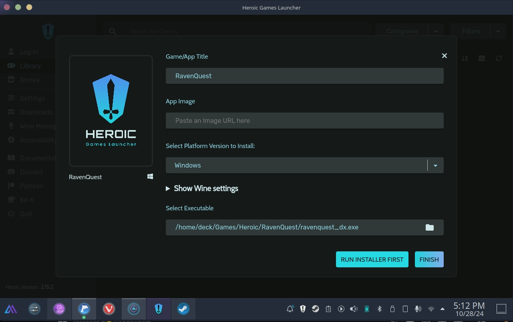

# How to play RavenQuest on Linux using Heroic Games Launcher with Proton

*A guide written by Urdhi for the RavenQuest community :heart:*

# Table of Contents
1. [Prerequisites](#prerequisites)
2. [Installing Heroic Games Launcher](#installing-heroic-games-launcher)
3. [Setting up Heroic Games Launcher](#setting-up-heroic-games-launcher)
4. [Installing RavenQuest](#installing-ravenquest)
5. [Adding missing Libraries](#adding-missing-libraries)
6. [Adding to your Steam Library](#adding-to-your-steam-library)


## Prerequisites
Before getting started, make sure you meet these requirements:

 1. **A Linux Distribution**:
  This guide works for most Linux distributions, including **Ubuntu**, **Fedora**, **Debian**, **Pop!_OS**, **Manjaro**, **Steam OS (SteamDeck)**, etc..
 2. **Graphics Drivers**:
	 - **NVIDIA**: Install proprietary NVIDIA drivers.
	 - **AMD**: Use the latest open-source **Mesa** drivers.
	 - **Intel**: Ensure the latest **Mesa** drivers are installed.
 3. **Flatpak**: Required if installing Heroic via Flatpak.
 4. **Internet Connection**: A stable connection is necessary for downloading Heroic Games Launcher, Proton, and the game itself.


## Installing Heroic Games Launcher
### Method 1: Install via Flatpak (Recommended)
If you use a SteamDeck use **Method 3**!

 1. Install Flatpak (if not already installed) with the appropriate command for your distribution:
 ```BASH
 sudo apt install flatpak # Debian/Ubuntu-based
 sudo dnf install flatpak # Fedora-based
 sudo pacman -S flatpak   # Arch-based
 ```

2. Add the Flathub repository:
```BASH
flatpak remote-add --if-not-exists flathub https://flathub.org/repo/flathub.flatpakrepo
```

3. Install Heroic Games Launcher:
 ```BASH
flatpak install flathub com.heroicgameslauncher.hgl
```

### Method 2: Install via AppImage (alternative)
1. Download the **AppImage** from [Heroic Games Launcher’s GitHub releases](https://github.com/Heroic-Games-Launcher/HeroicGamesLauncher/releases).
2. Make the AppImage executable
```BASH
chmod +x Heroic-*.AppImage
```
3. Run the AppImage:
```BASH
./Heroic-*.AppImage
```

### Method 3: SteamDeck
On SteamDeck, install Heroic Games Launcher via Discover as a Flatpak.


## Setting up Heroic Games Launcher
### Install Proton
- Click on *Wine Manager* in the left side menu.
- Install the latest Proton-GE version by clicking on the download button to the right.  
This option will automatically keep the Proton version up to date.


### Adjust Settings
- Click on *Settings* in the left side menu.  
- Click on *Game Defaults* and select the installed Proton version (Proton-GE-latest).  
- Adjust the settings according to the screenshots below.


## Installing RavenQuest
Follow these steps to install and set up **RavenQuest**:
- Download the game installer (EXE file) from [RavenQuest’s website](https://ravenquest.io).
- In Heroic Games Launcher, click on *Library* in the left menu and on one of the *ADD GAME* buttons.
- A pop-up will appear where you can set the game name and icon.
- Click on *RUN INSTALLER FIRST* and select the downloaded installer *ravenquest_installer.exe*.
- Run the RavenQuest installer and configure it as needed. Uncheck launch game at the end and note the installation path.
- After the installation finished select the game executable in the pop-up.  
Navigate to the installation directory and select *ravenquest_dx.exe*.
- Click *FINISH* to add the game to your library.
- Click the green play button to start the game.  
Let the initial update process complete and then restart the game.
- After the restart of the game you'll encounter an error message, this is due to missing libraries.  
Close the game.





## Adding missing Libraries
To fix the startup error and prevent shader issues (e.g., odd character colors) many Linux user encounter:
- In the game tile, click the settings icon.
- In the pop-up, go to the *WINE* tab.
- Scroll down, click on *WINETRICKS* and click on *OPEN WINETRICKS GUI* (this may take a moment).
- Click *OK*, then select the first entry *Install a Windows DLL or component* and click *OK* again.
- Select *d3dcompiler_47* and click *OK*.  
Once installation completes, close all windows to return to the library.
- Start the game and enjoy **RavenQuest** on Linux!


## Adding to your Steam Library
For easier access on SteamDeck, you can add RavenQuest to your Steam Library:

- Click on the game icon of the tile in your Heroic Library.
- Click on the button with three dots in the upper-right corner and select *Add to Steam*.


---

*I hope my guide helps you and enables you to play this wonderful game on Linux. :penguin: :heart:  
If you have any questions, please feel free to contact me in the Discord (.frankyi). Spread the word, but please mention me as the author!*
